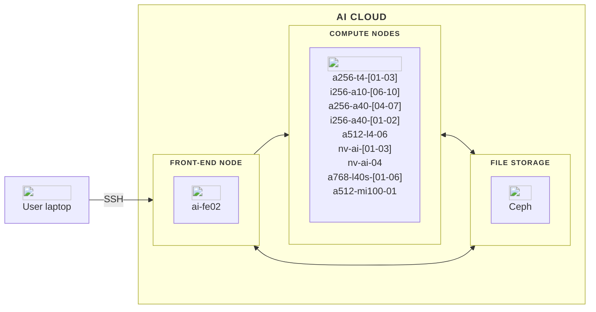
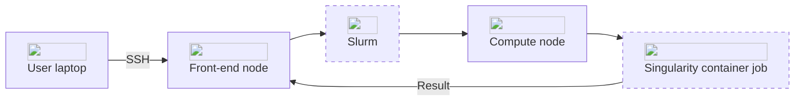

## Hardware
The AI Cloud platform is built around several key components, including a front-end node for managing tasks and code, and 27 compute nodes equipped with diverse hardware options.

In this overview, you will find a description of each major component of AI Cloud. Below, is a diagram illustrating the architecture of the AI Cloud platform.


<hr>

### Front-end node

You start by logging into a front-end node, `ai-fe02.srv.aau.dk`. This node acts as the gateway to the cluster. Here, you can manage files, write and edit code, and prepare your computational tasks. It is important to note that the front-end node is not intended for heavy computations, as it is a node with a very modest amount of resources, and that crashing the node, will affect all users on the system.

<hr>

### Compute nodes
AI Cloud consists the following compute nodes:

| Name             | Nodes in total | CPU cores per node| CPU type  | RAM per node | GPUs per node    | GPU type    | RAM per GPU  | Local Disk   | NVLINK |
| ---              | ---            | ---               |           | ---          | ---              | ---         | ---          | ---          | ---    |
| a256-t4-[01-03]  | 3              | 32                |AMD EPYC   | 256 GB       | 6                | NVIDIA T4   | 16 GB        | -            | No     |
| a256-a40-[04-07] | 4              | 32                |AMD EPYC   | 256 GB       | 3                | NVIDIA A40  | 48 GB        | -            | No     |
| i256-a10-[06-10] | 5              | 32                |Intel Xeon | 256 GB       | 4                | NVIDIA A10  | 24 GB        | -            | No     |
| i256-a40-[01-02] | 2              | 24                |Intel Xeon | 256 GB       | 4                | NVIDIA A40  | 48 GB        | 6.4 TB /raid | Yes    |
| a512-l4-06       | 1              | 64                |AMD EPYC   | 512 GB       | 8                | NVIDIA L4   | 24 GB        | -            | No     |
| a768-l40s-[01-06]| 6              | 64                |AMD EPYC   | 768 GB       | 8                | NVIDIA L40s | 48 GB        | -            | No     |
| nv-ai-[01-03]    | 3              | 48                |Intel Xeon | 1470 GB      | 16               | NVIDIA V100 | 32 GB        | 30 TB /raid  | Yes    |
| nv-ai-04         | 1              | 128               |AMD EPYC   | 980 GB       | 8                | NVIDIA A100 | 40 GB        | 14 TB /raid  | Yes    |


??? info "Further inspection of hardware"

    It's also possible to inspect the compute node hardware using the following commands:
    
    A detailed overview of the CPU
    ```
    srun -w a768-l40s-01 lscpu
    ```
    An overview of the host RAM:
    ```
    srun -w a768-l40s-01 free -h
    ```
    An overview of the GPU (only shows the number of GPU devices you ask for):
    ```
    srun -w a768-l40s-01 -G 1 nvidia-smi
    ```
    
The compute nodes `i256-a40-01`, `i256-a40-02` and `nv-ai-04` are owned by specific research groups, and  members of these groups have first-priority access to these. Other users can access them on a limited basis via the "batch" partition (use option `--partition=batch` for your jobs). These jobs will run until, a member from the aforementioned research groups makes a request for them, at which point the batch-job, will be interrupted.

## Software
AI Cloud is essentially just a cluster of Linux servers that use Ubuntu as their operating system. 

The recommended way of interacting with the platform is using the command line - find the essential commands for doing this on [linuxjourney.com](https://linuxjourney.com/lesson/the-shell).

The platform leverages two primary software components: [Slurm](/ai-cloud/system-overview/#slurm) and [Singularity](/ai-cloud/system-overview/#singularity). Learning how to use these tools, is an integral part of learning how to use the system. As they are commonly found on most HPC systems, learning how to use them will also open up the possibility of scaling your project to a [larger supercomputer](/external-hpc/).

### Slurm
[Slurm](https://slurm.schedmd.com/quickstart.html) is the queueing mechanism used for scheduling and managing resources on AI Cloud. It provides essential features such as:

- **Job Scheduling:** Allocating resources to jobs based on user requests and system policies.
- **Resource Management:** Tracking and managing compute resources, ensuring optimal utilization.
- **Queue Management:** Organizing jobs into queues, prioritizing and executing them based on policies and resource availability.

On AI Cloud, Slurm is responsible for managing the allocation and scheduling of compute resources, ensuring that user jobs are executed efficiently and fairly.

<hr>

### Singularity
[Singularity](https://docs.sylabs.io/guides/3.5/user-guide/introduction.html) is a container platform designed for running applications on AI Cloud. Containers are portable and reproducible environments that bundle an application's code, libraries, and dependencies. Key features of Singularity include:

- **Compatibility:** Running containers with high-performance computing workloads without requiring root privileges.
- **Portability:** Enabling the same container to run on different systems without modification.
- **Integration with HPC Systems:** Designed to work seamlessly with HPC job schedulers like Slurm.

<hr>

### Interconnection of Slurm and Singularity
On AI Cloud, Slurm and Singularity work together. Slurm handles the job scheduling and resource allocation, while Singularity ensures that the specified container environment is instantiated and the application runs with all its dependencies.


<hr>

## Storage

### Network drive storage

All nodes in the cluster are connected to the same network storage system. This ensures that all nodes in the cluster have access to the same files. There's no need to specify additional parameters to make your files available on the compute nodes or in container environments.

Check out our page [Overview of directories](/ai-cloud/additional-guides/directories-overview/) to learn more.
