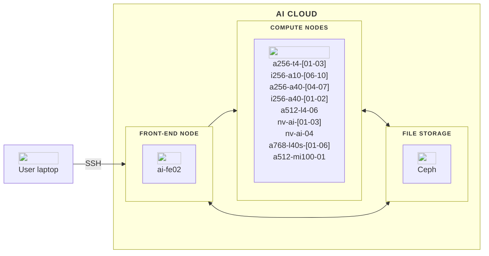
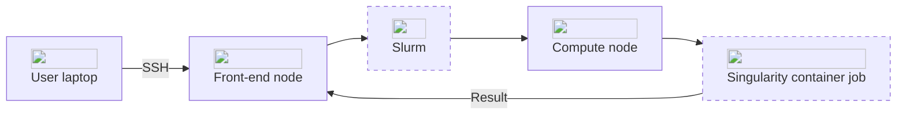

## Hardware
The AI Cloud platform is built around several key components, including a front-end node for managing tasks and code, and 27 compute nodes equipped with diverse hardware options.

In this overview, you will find a description of each major component of AI Cloud. Below, is a diagram illustrating the architecture of the AI Cloud platform.




<hr>

## Front-end node
You start by logging into a front-end node, `ai-fe02`. This node act as the gateway to the HPC system. Here, you can manage files, write and edit code, and prepare your computational tasks. It is important to note that the front-end node are not intended for heavy computations; It is optimized for task preparation and interaction with the HPC environment.

<hr>

## Compute nodes
AI Cloud currently include the following compute nodes:


| Name             | Nodes in total |GPUs per node     | CPU cores per node | CPU HW threads | RAM per node | RAM per GPU  | Local Disk   | NVLINK / Infinity Frabric Link | Primary usage                         |
| ---              | ---            | ---              | ---                | ---            | ---          | ---          | ---          | ---                            | ---                                   |
| a256-t4-[01-03]  | 3              | 6 (NVIDIA T4)    | 32 (AMD EPYC)      | 64             | 256 GB       | 16 GB        | -            | No                             | Interactive / smaller single-GPU jobs |
| i256-a10-[06-10] | 5              | 4 (NVIDIA A10)   | 32 (Intel Xeon)    | 64             | 256 GB       | 24 GB        | -            | No                             | Interactive / medium single-GPU jobs  |
| a256-a40-[04-07] | 4              | 3 (NVIDIA A40)   | 32 (AMD EPYC)      | 32             | 256 GB       | 48 GB        | -            | No                             | Large single-GPU jobs                 |
| i256-a40-[01-02] | 2              | 4 (NVIDIA A40)   | 24 (Intel Xeon)    | 24             | 256 GB       | 48 GB        | 6.4 TB /raid | Yes (2&times;2)                | Large single-/multi-GPU jobs          |
| a512-mi100-01    | 1              | 8 (AMD MI100)    | 16 (AMD EPYC)      | 32             | 512 GB       | 32 GB        | -            | Yes (Infinity Fabric link)     | Large / batch / multi-GPU jobs        |
| a512-l4-06       | 6              | 8 (NVIDIA L4)    | 64 (AMD EPYC)      | 128            | 512 GB       | 24 GB        | -            | No                             | Large / batch / multi-GPU jobs        |
| a768-l40s-[01-06]| 6              | 8 (NVIDIA L40s)  | 64 (AMD EPYC)      | 128            | 768 GB       | 48 GB        | -            | No                             | Large / batch / multi-GPU jobs        |
| nv-ai-[01-03]    | 3              | 16 (NVIDIA V100) | 48 (Intel Xeon)    | 96             | 1470 GB      | 32 GB        | 30 TB /raid  | Yes                            | Large / batch / multi-GPU jobs        |
| nv-ai-04         | 1              | 8 (NVIDIA A100)  | 128 (AMD EPYC)     | 256            | 980 GB       | 40 GB        | 14 TB /raid  | Yes                            | Large / batch / multi-GPU jobs        |

!!! info "Note"

    The compute nodes nv-ai-04, i256-a40-01, and i256-a40-02 are owned by specific research groups or centers which have first-priority access to them. Other users can only access them on a limitied basis where your jobs may be cancelled by higher-priority jobs. Users outside the prioritised group can only use them via the "batch" partition (use option `--partition=batch` for your jobs).


## Software
AI Cloud is based on Ubuntu Linux as its operating system. In practice, working on AI Cloud primarily takes place via a command-line interface.

AI Cloud leverages two primary software components: [Slurm](https://slurm.schedmd.com/quickstart.html) and [Singularity](https://docs.sylabs.io/guides/3.5/user-guide/introduction.html). Understanding these tools and how they work together is crucial for efficiently utilizing the AI Cloud platform.

## Slurm
[Slurm](https://slurm.schedmd.com/quickstart.html) is the workload manager used for scheduling and managing jobs on AI Cloud. It provides essential features such as:

- **Job Scheduling:** Allocating resources to jobs based on user requests and system policies.
- **Resource Management:** Tracking and managing compute resources, ensuring optimal utilization.
- **Queue Management:** Organizing jobs into queues, prioritizing and executing them based on policies and resource availability.

On AI Cloud, Slurm is responsible for managing the allocation and scheduling of compute resources, ensuring that user jobs are executed efficiently and fairly.

<hr>

## Singularity
[Singularity](https://docs.sylabs.io/guides/3.5/user-guide/introduction.html) is a container platform designed for running applications on AI Cloud. Containers are portable and reproducible environments that bundle an application's code, libraries, and dependencies. Key features of Singularity include:

- **Compatibility:** Running containers with high-performance computing workloads without requiring root privileges.
- **Portability:** Enabling the same container to run on different systems without modification.
- **Integration with HPC Systems:** Designed to work seamlessly with HPC job schedulers like Slurm.

<hr>

## Interconnection of Slurm and Singularity
On AI Cloud, Slurm and Singularity work together. Slurm handles the job scheduling and resource allocation, while Singularity ensures that the specified container environment is instantiated and the application runs with all its dependencies.




## Storage
AI Cloud utilizes [Ceph](https://docs.ceph.com/) as its storage solution, providing a robust and scalable file system for your data needs. Your files are organized within the Ceph file system hierarchy, ensuring efficient access and management across the entire platform.

<hr>

## User Directory
Your user directory serves as the primary location for storing personal files and data. It is structured within the Ceph file system as follows:

<div class="tree">
    <ul>
    <li><i class="fa fa-folder-open"></i> / <span>AI Cloud's file system</span>
        <ul>
        <li><i class="fa fa-folder-open"></i> home <span>user home directories</span>
            <ul>
            <li><i class="fa fa-folder-open"></i> [domain] <span>e.g student.aau.dk</span>
                <ul>
                    <li><i class="fa fa-folder"></i> [user] <span>your user directory</span></li>
                </ul>
            </li>
            </ul>
        </li>
        </ul>
    </li>
    </ul>
</div>

Here, [domain] represents your domain or institution (e.g., student.aau.dk), and [user] denotes your unique username on the platform. Any files you store within your user directory are private.

<hr>

## Shared Project Directories
AI Cloud fosters collaborative work through shared project directories. These directories enable multiple users to collaborate on projects by providing a centralized space for data sharing and collaboration. Shared project directories are organized under the project directory within the Ceph file system:

<div class="tree">
    <ul>
    <li><i class="fa fa-folder-open"></i> /home <span>AI Cloud's file system</span>
        <ul>
        <li><i class="fa fa-folder-open"></i> project <span>shared project directories</span>
            <ul>
            <li><i class="fa fa-folder"></i> project_X
            </li>
            </ul>
        </li>
        </ul>
    </li>
    </ul>
</div>

Your projects directory is a subdirectory to an overall project directories folder hierarchy.

Go in to the project directory

```
cd /home/project
```

Before going ahead and creating a directory for group project, please consider naming the directory in a meaningful manner (ie. after your group or research project) A project directory can be created in the following manner (swap out `<name>` for the actual name of your project).

```
mkdir <name> 
```

Please remember, that these directories should be deleted when your project is finished, and you no longer need them. They are not intended for long term data storage.

## Storage quota expansions
When users log in to AI Cloud for the first time, a user directory is created for them. These directories are allocated 1 TB of storage by default. This should be plenty for most users, but should you need additional space, it is possible to apply for storage quota expansions for a limited time using our [Storage quota expansions form](https://forms.office.com/e/AjT0GccAPb).

!!! info
    When you log in to the platform, you can see your storage usage of the user directory at the very top line:

    ```
    Current quota usage: 181GiB / 1.0TiB
    Welcome to Ubuntu 20.04.6 LTS (GNU/Linux 5.4.0-169-generic x86_64)

    * Documentation:  https://help.ubuntu.com
    * Management:     https://landscape.canonical.com
    * Support:        https://ubuntu.com/pro

    System information as of Fri Mar 15 11:09:21 CET 2024
    ```
