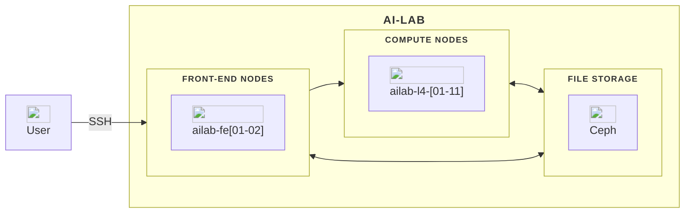

                                            
# 🎓 Welcome to **AI-LAB Workshop** 🎓

This workshop introduces you to the AI-LAB computing platform — a GPU-powered system for AI and deep learning.

**Presenter -** Frederik Petri Svenningsen *Data Scientist, CLAAUDIA – research data services*


<div class="workshop-internal-break" role="separator"></div>


## Accessing AI-LAB

Before you can log in, you’ll need to complete this [application form](https://forms.office.com/Pages/ResponsePage.aspx?id=Sbrb9QbOb0msPgzxQ2HZNEdKMbCNz_9Lom8_yaZURCNUNjcwRzFLWkYyUDVPTjFLUDRTT0JZUzZCOCQlQCN0PWcu).


<div class="workshop-internal-break" role="separator"></div>


## Workshop overview

You’ll learn to:

* Log in to AI-LAB securely
* Navigate the **Linux** environment
* Run and monitor jobs using **Slurm**
* Use **containers** for AI workloads
* Manage resources efficiently


<div class="workshop-internal-break" role="separator"></div>


**Next:** [What is AI-LAB →](2-what-is-ai-lab.md)

---

# What is AI-LAB?

#### AI-LAB is a GPU-powered mini-supercomputer that lets students run AI experiments, deep-learning projects, and simulations without needing their own advanced hardware.


<div class="workshop-internal-break" role="separator"></div>


## 💻 What You Can Do

AI-LAB allows you to:

* Train deep learning models on **GPU hardware**
* Run AI experiments and simulations
* Collaborate with classmates or research groups
* Access powerful resources **without owning a GPU**


<div class="workshop-internal-break" role="separator"></div>


## 🔧 Why Use AI-LAB?

* Centralized system: no setup needed
* Preinstalled environments (PyTorch, TensorFlow, etc.)
* Fair resource sharing through **Slurm**
* Remote access from anywhere


<div class="workshop-internal-break" role="separator"></div>


## 🧠 Example Use Cases

* Deep learning projects for courses
* Research prototypes
* Data processing or simulation workloads


<div class="workshop-internal-break" role="separator"></div>


**Next:** [AI-LAB Under the Hood →](3-ai-lab-under-the-hood.md)


---

# AI-LAB under the hood

AI-LAB combines specialized hardware and software to deliver high-performance computing for AI workloads.


<div class="workshop-internal-break" role="separator"></div>





<div class="workshop-internal-break" role="separator"></div>


## 🖥️ Hardware Overview

| Component         | Description                                    |
| ----------------- | ---------------------------------------------- |
| **Login Nodes**   | 2 nodes for connecting and submitting jobs     |
| **Compute Nodes** | 11 powerful machines with GPUs                 |
| **GPUs**          | NVIDIA L4 GPUs (8 per node, 24 GB memory each) |
| **Storage**       | Central networked storage via Ceph             |


<div class="workshop-internal-break" role="separator"></div>


## ⚙️ Software Stack

| Layer      | Tool            | Purpose                                |
| ---------- | --------------- | -------------------------------------- |
| Scheduler  | **Slurm**       | Manages compute resources and queues   |
| Containers | **Singularity** | Isolates applications and dependencies |


<div class="workshop-internal-break" role="separator"></div>


**Next:** [The AI-LAB Workflow →](4-the-ai-lab-workflow.md)


---

# The AI-LAB workflow

AI-LAB follows a simple 4-step workflow for running AI experiments efficiently.


<div class="workshop-internal-break" role="separator"></div>


## 🔄 Workflow Overview

1. **Log in** from your local computer
2. **Upload** your code and data
3. **Run** compute jobs on the GPUs using Slurm
4. **View or download** your results


<div class="workshop-internal-break" role="separator"></div>


**Next:** [Logging into AI-LAB →](5-logging-into-ai-lab.md)

---

# The AI-LAB workflow

AI-LAB follows a simple 4-step workflow for running AI experiments efficiently.


<div class="workshop-internal-break" role="separator"></div>


## 🔄 Workflow Overview

1. **Log in** from your local computer
2. **Upload** your code and data
3. **Run** compute jobs on the GPUs using Slurm
4. **View or download** your results


<div class="workshop-internal-break" role="separator"></div>


**Next:** [Logging into AI-LAB →](5-logging-into-ai-lab.md)

---

# Logging into AI-LAB

You connect to AI-LAB using **SSH (Secure Shell)**.


<div class="workshop-internal-break" role="separator"></div>


## 💻 Login Nodes

There are two frontend nodes:

* `ailab-fe01.srv.aau.dk`
* `ailab-fe02.srv.aau.dk`

Use either when logging in.


<div class="workshop-internal-break" role="separator"></div>


## 🔐 Logging In

Open your terminal (Windows users should use **PowerShell**) and run:

```bash
ssh user@student.aau.dk@ailab-fe01.srv.aau.dk
```

Replace `user@student.aau.dk` with your actual AAU email address.

The first time you connect, type `yes` to trust the server fingerprint.
Then enter your **AAU password** (no stars are shown while typing).


<div class="workshop-internal-break" role="separator"></div>


> **Having login issues?** Check out the [troubleshooting guide](/ai-lab/troubleshooting/#why-cant-i-connect-to-ai-lab) for solutions.


<div class="workshop-internal-break" role="separator"></div>


**Next:** [File Handling on AI-LAB →](6-file-handling-on-ai-lab.md)

---

# File handling on AI-LAB

All your files are stored in network-mounted directories shared across the system.


<div class="workshop-internal-break" role="separator"></div>


## 📂 Default User Directory

Your personal home directory:

```
/ceph/home/[domain]/[user]
```


<div class="workshop-internal-break" role="separator"></div>


## 👨‍👦‍👦 Shared Spaces

| Path              | Purpose                  |
| ----------------- | ------------------------ |
| `/ceph/project`   | Shared project folders   |
| `/ceph/course`    | Course-related materials |
| `/ceph/container` | Ready-to-use containers  |


> Private project folders can be created among semestergroup members — [follow this guide](/ai-lab/guides/file-handling/#creating-shared-project-directories).


<div class="workshop-internal-break" role="separator"></div>


**Next:** [Essential Linux Commands →](7-essential-linux-commands.md)

---

# Essential Linux commands

AI-LAB runs on Linux — here are the basics you’ll need.


<div class="workshop-internal-break" role="separator"></div>


## 📁 Navigating Directories

```bash
pwd            # Show current directory
ls             # List files
cd foldername  # Change directory
```


<div class="workshop-internal-break" role="separator"></div>


## 📄 Managing Files

```bash
cp file1 file2     # Copy file
mv file1 folder/   # Move or rename file
rm file1           # Delete file
mkdir newfolder    # Create a folder
cat file.txt       # Display file contents
```


<div class="workshop-internal-break" role="separator"></div>


## ✏️ Editing Files

Use the **micro** editor:

```bash
micro myscript.sh
```

* Save: `Ctrl + S` then Enter
* Exit: `Ctrl + Q`


<div class="workshop-internal-break" role="separator"></div>


**Next:** [Transferring Files →](8-transferring-files.md)

---

# Transferring files

Use **scp** (secure copy) to upload and download files between your local computer and AI-LAB.


<div class="workshop-internal-break" role="separator"></div>


## 📤 Uploading Files

```bash
scp -r myfile.txt user@student.aau.dk@ailab-fe01.srv.aau.dk:~
```

## 📥 Downloading Files

```bash
scp -r user@student.aau.dk@ailab-fe01.srv.aau.dk:~/myfile.txt .
```

* `-r` copies directories recursively
* `~` means your home directory on AI-LAB


<div class="workshop-internal-break" role="separator"></div>


## 💻 File managers (recommended)
For Windows users, we recommend [**WinSCP**](https://winscp.net/eng/download.php). 

For Linux, macOS, or Windows (cross-platform), we recommend [**Double Commander**](https://sourceforge.net/p/doublecmd/wiki/Download/).


<div class="workshop-internal-break" role="separator"></div>


**Next:** [Slurm →](9-slurm.md)

---

# Slurm

**Slurm** is the job scheduler that manages compute resources on AI-LAB.


<div class="workshop-internal-break" role="separator"></div>


## 🧠 What Slurm Does

* **Allocates** CPUs, GPUs, and memory to jobs
* **Queues** jobs when resources are busy
* **Ensures fairness** among users


<div class="workshop-internal-break" role="separator"></div>


## 🔍 Useful Commands

```bash
squeue          # View all jobs
squeue --me     # View your jobs
sinfo           # Show node status
nodesummary     # Display resource allocations
```


<div class="workshop-internal-break" role="separator"></div>


**Next:** [Two Ways of Running Jobs →](10-two-ways-of-running-jobs.md)

---

# Two ways of running jobs

You can run compute tasks in two main ways on AI-LAB: **interactive (srun)** or **batch (sbatch)**.


<div class="workshop-internal-break" role="separator"></div>


## 1️⃣ Interactive Job – srun

Runs immediately in your terminal session.

```bash
srun -u echo "Hello from compute node"
```

Use for quick tests or debugging.

`-u` forces srun to print outputs immediately


<div class="workshop-internal-break" role="separator"></div>


## 2️⃣ Batch Job – sbatch

Submit a script to run in the background.

```bash title="run.sh"
#!/bin/bash
echo "Hello from compute node"
```

Submit it:

```bash
sbatch run.sh
```


<div class="workshop-internal-break" role="separator"></div>


**Next:** [Exercise 1 →](11-exercise-1.md)

---

# Exercise 1: Run a simple job with srun


<div class="workshop-internal-break" role="separator"></div>


1. Download workshop files by running this command:

      ```bash
      ailab --workshop
      ```

2. Change directory (`cd`) to `workshop`

    ??? info "Hint"
        ```bash
        cd ~/workshop
        ```

3. Run the script `simple_script.py` with `python3` using `srun -u`

    ??? info "Hint"
        ```bash
        srun -u python3 simple_script.py
        ```

4. ...and you should get:

```
...
Second 29...
Second 30...
Done after 30 seconds!
```


<div class="workshop-internal-break" role="separator"></div>


**Next:** [Creating an sbatch Script →](12-creating-a-sbatch-script.md)


---

# Creating an sbatch script

Batch scripts tell Slurm what to run and which resources to use.


<div class="workshop-internal-break" role="separator"></div>


## ✏️ Creating a script

Create your script using micro or your preferred editor:

```bash
micro run.sh
```

```bash title="run.sh"
#!/bin/bash

#SBATCH --job-name=myjob       
#SBATCH --time=0:10:00 
#SBATCH --output=myjob.log

echo "Hello from compute node"
sleep 60
echo "Done sleeping"
```

Save and exit (`Ctrl+S`, Enter, `Ctrl+Q`).


<div class="workshop-internal-break" role="separator"></div>


## 🚀 Submit your script

Submit the batch script to Slurm:

```bash
sbatch run.sh
```

This command sends your script to the Slurm scheduler, which will run it when resources become available.


<div class="workshop-internal-break" role="separator"></div>


## 📄 Check the output

Once your job completes, check the output file:

```bash
cat myjob.log
```


<div class="workshop-internal-break" role="separator"></div>


**Next:** [Exercise 2 →](13-exercise-2.md)

---

# Exercise 2: Create and submit a batch script

Practice creating and submitting batch scripts.


<div class="workshop-internal-break" role="separator"></div>


1. Use `micro` text editor (or any other if you're an experienced Linux user) to open the script `run.sh` that already exist in the workshop directory.

    ??? info "Hint"
        ```bash
        micro run.sh
        ```

2. In the bottom of the script, add:
   
      ```
      python3 simple_script.py
      ```
   
3. Save it by hitting `CTRL + S` and then `CTRL + Q` to exit nano.


4. Submit the job using `sbatch`

    ??? info "Hint"
        ```bash
        sbatch run.sh
        ```

5. Check the job status using `squeue --me`

    ??? info "Hint: Make it update every second"
        ```bash
        watch -n1 squeue --me
        ```

6. Once completed, check the results by printing out the output file using `cat` command
   
    ??? info "Hint"
        ```bash
        cat myjob.log
        ```


<div class="workshop-internal-break" role="separator"></div>


**Next:** [Allocating Resources →](14-allocating-resources.md)


---

--8<-- "ai-lab/workshop/14-all# Allocating resources

When running jobs, you can request specific resources like memory, CPUs, and GPUs.


<div class="workshop-internal-break" role="separator"></div>


### 💾 System memory

```
--mem=40G
```

### ⚙️ CPUs

```
--cpus-per-task=15
```

### 🎮 GPUs

```
--gres=gpu:1
```

!!! info "GPU Resource Limits"
    To ensure fair access for all users, AI-LAB enforces two important limits:
    
    - **Maximum 4 GPUs per job**: A single job can request no more than 4 GPUs (e.g., `--gres=gpu:4`)
    - **Maximum 8 GPUs per user**: Each user can run jobs using a total of up to 8 GPUs simultaneously across all their running jobs
    
    We strongly encourage inexperienced users to allocate only 1 GPU, as most workloads do not speed up automatically with more GPUs.


<div class="workshop-internal-break" role="separator"></div>


## 🚀 Example: Allocating resources with srun

```bash
srun --cpus-per-task=4 --mem=8G --gres=gpu:1 python3 my_script.py
```


<div class="workshop-internal-break" role="separator"></div>


## 📝 Example: Allocating resources with sbatch

In a batch script, add resource requests using `#SBATCH` directives:

```bash title="run.sh"
#!/bin/bash
#SBATCH --gres=gpu:1         # Request 1 GPU
#SBATCH --cpus-per-task=4    # Request 4 CPUs
#SBATCH --mem=8G             # Request 8 GB memory

python3 my_script.py
```


<div class="workshop-internal-break" role="separator"></div>


**Next:** [Containers →](15-containers.md)
ocating-resources.md"

---

# Containers on AI-LAB

AI-LAB uses **Singularity** containers to run applications safely and reproducibly.


<div class="workshop-internal-break" role="separator"></div>


## 📦 What are containers?

Containers bundle:

* Application code
* Libraries and dependencies
* Configuration files

They ensure your code runs the same everywhere.


<div class="workshop-internal-break" role="separator"></div>


## 📢 Why containers?

* Designed for HPC environments
* Runs without admin privileges
* Uses `.sif` container files


<div class="workshop-internal-break" role="separator"></div>


**Next:** [Getting Containers →](16-getting-containers.md)

---

# Getting containers on AI-LAB

You can use preinstalled containers, download them, or create your own.


<div class="workshop-internal-break" role="separator"></div>


## 🏗️ Pre-downloaded containers

Stored in:

```
/ceph/container
```

List available containers:

```bash
ailab --list-containers
```


<div class="workshop-internal-break" role="separator"></div>


## 🌐 Download from NGC or Docker Hub

Follow [this AI-LAB guide](/ai-lab/guides/getting-containers/#2-download-containers) for downloading containers from:

* **NVIDIA NGC**
* **Docker Hub**


<div class="workshop-internal-break" role="separator"></div>


## 🧱 Build your own

Create a `.def` file and build your container using Singularity.
See [AI-LAB’s guide](/ai-lab/guides/getting-containers/#3-build-your-own-container-advanced) for how to create your own container.


<div class="workshop-internal-break" role="separator"></div>


**Next:** [Using Containers →](17-using-containers.md)

---

# Using containers on AI-LAB

Let's run a simple Python script inside a Singularity container with GPU support.


<div class="workshop-internal-break" role="separator"></div>


## 🚀 Example: Running a container with srun

```bash
srun singularity exec --nv /ceph/container/pytorch/pytorch_25.04.sif python3 gpu_stress.py
```


<div class="workshop-internal-break" role="separator"></div>


## 📝 Example: Running a container with sbatch

In a batch script, add resource requests using `#SBATCH` directives:

```bash title="run.sh"
#!/bin/bash

singularity exec --nv /ceph/container/pytorch/pytorch_25.04.sif python3 gpu_stress.py
```


<div class="workshop-internal-break" role="separator"></div>


## 📖 Understanding the Singularity command

Let's break down what each part does:

* `singularity exec`: Tells Singularity to execute something inside the container.
* `--nv`: Tells Singularity to include NVIDIA libraries. **Always use this flag when running GPU-accelerated code** so your container can access the GPU.
* `/ceph/container/pytorch/pytorch_25.04.sif`: The path to your container file. This is a pre-downloaded PyTorch container stored on AI-LAB.
* `python3 gpu_stress.py`: The command to run inside the container. This executes your Python script using Python 3 from within the container environment.


<div class="workshop-internal-break" role="separator"></div>


**Next:** [Exercise 3 →](18-exercise-3.md)

---

# Exercise 3: Running a GPU script with containers and resources

Let's try running a Python GPU script inside a PyTorch container with resources allocated.


<div class="workshop-internal-break" role="separator"></div>


1. Inside the workshop directory, you will also find a file called `run_container.sh`

2. Check the file content using `cat run_container.sh`

3. Submit the job using `sbatch`

    ??? info "Hint"
        ```bash
        sbatch run_container.sh
        ```

4. Check the job status using `squeue --me` and find the JOBID.

    ??? info "Hint: How to find the JOBID"
        Here, `162841` is the JOBID
        ```bash
             JOBID PARTITION     NAME     USER ST       TIME  NODES NODELIST(REASON)
            162841        l4    myjob ry90cd@i  R      10:25      1 ailab-l4-11
        ```

5. Check the GPU utilization be running the following command:

    ```
    ailab --gpu-util 162841
    ```
     
    Replace `162841` with your JOBID

    ??? info "Hint: Understanding GPU Metrics"
        
        Key metrics to watch:

        GPU-Util: Percentage of GPU being used (aim for 70-100% during training)
        Memory-Usage: How much GPU memory your job is using
        Temperature: GPU temperature (should stay below 80°C)
        Power: Power consumption (indicates workload intensity)

        ```
        +-----------------------------------------------------------------------------------------+
        | NVIDIA-SMI 555.42.02              Driver Version: 555.42.02      CUDA Version: 12.5     |
        |-----------------------------------------+------------------------+----------------------+
        | GPU  Name                 Persistence-M | Bus-Id          Disp.A | Volatile Uncorr. ECC |
        | Fan  Temp   Perf          Pwr:Usage/Cap |           Memory-Usage | GPU-Util  Compute M. |
        |                                         |                        |               MIG M. |
        |=========================================+========================+======================|
        |   0  NVIDIA L4                      Off |   00000000:01:00.0 Off |                    0 |
        | N/A   44C    P0             36W /   72W |     245MiB /  23034MiB |     90%      Default |
        |                                         |                        |                  N/A |
        +-----------------------------------------+------------------------+----------------------+
        |   1  NVIDIA L4                      Off |   00000000:02:00.0 Off |                    0 |
        | N/A   38C    P8             16W /   72W |       4MiB /  23034MiB |      0%      Default |
        |                                         |                        |                  N/A |
        +-----------------------------------------+------------------------+----------------------+
        |   2  NVIDIA L4                      Off |   00000000:41:00.0 Off |                    0 |
        | N/A   41C    P8             16W /   72W |       1MiB /  23034MiB |      0%      Default |
        |                                         |                        |                  N/A |
        ...

        +------------------------------------------------------------------------------+
        |  GPU    PID     USER    GPU MEM  %CPU  %MEM      TIME  COMMAND               |
        |    0 232843   user@+     236MiB   100   0.1  01:00:20  /usr/bin/python3 tor  |
        +------------------------------------------------------------------------------+
        ```

        The most important parameter to notice here is the GPU-Util metric. Here, you can see that the first GPU is operating at 90% GPU utilization. This indicates excellent utilization of the GPU.

        You can locate which GPU(s) that belongs to your job, by finding your username below USER and the GPU number under GPU. In this case user@+ are utilizing GPU number 0 in the NVIDIA-SMI list.

        ```
        +------------------------------------------------------------------------------+
        |  GPU    PID     USER    GPU MEM  %CPU  %MEM      TIME  COMMAND               |
        |    0 232843   user@+     236MiB   100   0.1  01:00:20  /usr/bin/python3 tor  |
        +------------------------------------------------------------------------------+
        ```
        
6. Once completed, cancel all your jobs by using `scancel -u $USER`


<div class="workshop-internal-break" role="separator"></div>


**Next:** [Final pointers →](19-final-pointers.md)

---

# Final pointers

Congratulations — you’ve reached the end of the AI-LAB workshop! 🎉


<div class="workshop-internal-break" role="separator"></div>


## ✅ Key reminders

* **Do not store confidential or sensitive data** (type 2 or 3)
* Jobs must **not exceed 12 hours**
* Read the [Fair Usage Policy](https://hpc.aau.dk/)
* Access resets **each August 1st**
* Expect **4 annual maintenance windows**


<div class="workshop-internal-break" role="separator"></div>


## 🆘 Need help?

Visit the **AAU Service Portal**:
[https://serviceportal.aau.dk](https://serviceportal.aau.dk/serviceportal?id=sc_cat_item&sys_id=a05e2fb4c3434610f0f3041ad001310e)


<div class="workshop-internal-break" role="separator"></div>


## 🚀 Coming soon

* VS Code integration on compute nodes
* Web-based AI-LAB interface


<div class="workshop-internal-break" role="separator"></div>


**🎓 Thank you for participating!**
