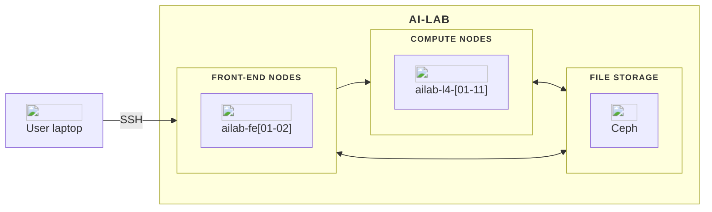
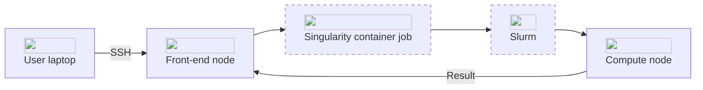

## Hardware
The AI-LAB platform is built around several key components, including two front-end nodes for managing tasks and code, and 11 compute nodes equipped with diverse hardware options.

In this overview, you will find a description of each major component of AI-LAB. Below, is a diagram illustrating the architecture of the AI-LAB platform.



<hr>

### Front-end nodes
You start by logging into a front-end node, either `ailab-fe01` or `ailab-fe02`. These nodes act as the gateway to the HPC system. Here, you can manage files, write and edit code, and prepare your computational tasks. It is important to note that front-end nodes are not intended for heavy computations; they are optimized for task preparation and interaction with the HPC environment.

<hr>

### Compute nodes
AI-LAB currently include the following compute nodes:

| Node name            | CPU model             | Number of CPUs | Number of cores | Number of GPUs | GPU Model | RAM pr GPU (GB) |
| -------------------- | --------------------- | -------------- | --------------- | -------------- | --------- | --------------- |
| ailab-l4-[01-11]     | AMD EPYC 7543 32-Core | 128            | 64              | 8              | NVIDIA L4 | 24              |


## Software

AI-LAB is based on Ubuntu Linux as its operating system. In practice, working on AI-LAB primarily takes place via a command-line interface.


AI-LAB leverages two primary software components: [Slurm](https://slurm.schedmd.com/quickstart.html) and [Singularity](https://docs.sylabs.io/guides/3.5/user-guide/introduction.html). Understanding these tools and how they work together is crucial for efficiently utilizing the AI-LAB platform.

### Slurm
[Slurm](https://slurm.schedmd.com/quickstart.html) is a powerful and highly configurable workload manager used for scheduling and managing compute jobs on AI-LAB. It provides essential features such as:

- **Job Scheduling:** Allocating resources to jobs based on user requests and system policies.
- **Resource Management:** Tracking and managing compute resources, ensuring optimal utilization.
- **Queue Management:** Organizing jobs into queues, prioritizing and executing them based on policies and resource availability.

On AI-LAB, Slurm is responsible for managing the allocation and scheduling of compute resources, ensuring that user jobs are executed efficiently and fairly.

``` mermaid
flowchart LR
  B["<span><img src="/assets/img/server.svg" width='25' height='25'>Front-end node</span>"]

  C["<span><img src="/assets/img/code-file.svg" width='25' height='25'>Job id 4</span>"]

  subgraph slurm[<p style="font-family: Barlow, sans-serif; font-weight: 800; font-size: 16px; text-transform: uppercase; color: #221a52; letter-spacing: 1px; margin: 10px;">Slurm queue</p>]
    direction LR
    D1["<span><img src="/assets/img/code-file.svg" width='25' height='25'>Job id 4</span>"]
    D2["<span><img src="/assets/img/code-file.svg" width='25' height='25'>Job id 3</span>"]
    D3["<span><img src="/assets/img/code-file.svg" width='25' height='25'>Job id 2</span>"]
    D1 -.- D2 -.- D3
    end

  subgraph cluster[<p style="font-family: Barlow, sans-serif; font-weight: 800; font-size: 12px; text-transform: uppercase; color: #221a52; letter-spacing: 1px; margin: 5px;">Compute nodes</p>]
    direction LR

    E1["<span><img src="/assets/img/code-file.svg" width='25' height='25'>Job id 1</span>"]
    E2["<span><img src="/assets/img/server.svg"  width='25' height='25' >ailab-l4-01</span>"]
    
    E1 --> E2
    end

  B --> C --> slurm --> cluster

  style D1 stroke-dasharray: 5 5

```



<hr>

### Singularity
[Singularity](https://docs.sylabs.io/guides/3.5/user-guide/introduction.html) is a container platform designed for running applications on AI-LAB. Containers are lightweight, portable, and reproducible environments that bundle an application's code, libraries, and dependencies. Key features of Singularity include:

- **Compatibility:** Running containers with high-performance computing workloads without requiring root privileges.
- **Portability:** Enabling the same container to run on different systems without modification.
- **Integration with HPC Systems:** Designed to work seamlessly with HPC job schedulers like Slurm.

<br>

#### Pre-Downloaded Containers on AI-LAB
AI-LAB provides a variety of pre-downloaded containers to help users get started quickly. These containers are stored in the `/ceph/container` directory. The list of available containers is periodically updated, and users can propose new containers by contacting the [support team](https://serviceportal.aau.dk/serviceportal?id=emp_taxonomy_topic&topic_id=82a253e8838fc21053711d447daad328). Currently available container images includes:

- PyTorch (CPU/GPU)
- TensorFlow (CPU/GPU)
- ImageMagick (CPU)
- MATLAB (CPU/GPU)

<hr>

### Interconnection of Slurm and Singularity
On AI-LAB, Slurm and Singularity work together. Slurm handles the job scheduling and resource allocation, while Singularity ensures that the specified container environment is instantiated and the application runs with all its dependencies.



## Storage
AI-LAB utilizes [Ceph](https://docs.ceph.com/) as its storage solution, providing a robust and scalable file system for your data needs. Your files are organized within the Ceph file system hierarchy, ensuring efficient access and management across the entire platform.

<hr>

### User Directory
Your user directory serves as the primary location for storing personal files and data. It is structured within the Ceph file system as follows:

<div class="tree">
    <ul>
    <li><i class="fa fa-folder-open"></i> /ceph <span>AI-LAB's file system</span>
        <ul>
        <li><i class="fa fa-folder-open"></i> home <span>user home directories</span>
            <ul>
            <li><i class="fa fa-folder-open"></i> [domain] <span>e.g student.aau.dk</span>
                <ul>
                    <li><i class="fa fa-folder"></i> [user] <span>your user directory</span></li>
                </ul>
            </li>
            </ul>
        </li>
        </ul>
    </li>
    </ul>
</div>

Here, [domain] represents your domain or institution (e.g., student.aau.dk), and [user] denotes your unique username on the platform. Any files you store within your user directory are private.

!!! info "Storage quota"
    When users log in to AI-LAB for the first time, a user directory is created for them. These directories are allocated 1 TB of storage by default. When you log in to the platform, you can see your storage usage of the user directory at the very top line:

    ```
    Current quota usage: 181GiB / 1.0TiB
    Welcome to Ubuntu 20.04.6 LTS (GNU/Linux 5.4.0-169-generic x86_64)

    * Documentation:  https://help.ubuntu.com
    * Management:     https://landscape.canonical.com
    * Support:        https://ubuntu.com/pro

    System information as of Fri Mar 15 11:09:21 CET 2024
    ```

<hr>

### Shared Project Directories
AI-LAB fosters collaborative work through shared project directories. These directories enable multiple users to collaborate on projects by providing a centralized space for data sharing and collaboration. Shared project directories are organized under the project directory within the Ceph file system:

<div class="tree">
    <ul>
    <li><i class="fa fa-folder-open"></i> /ceph <span>AI-LAB's file system</span>
        <ul>
        <li><i class="fa fa-folder-open"></i> project <span>shared project directories</span>
            <ul>
            <li><i class="fa fa-folder"></i> project_X
            </li>
            </ul>
        </li>
        </ul>
    </li>
    </ul>
</div>

==Comming soon: Guide on how to utilize this==

<hr>

### Course Materials
To support educational activities, AI-LAB hosts course-specific materials within dedicated directories. These materials include lecture notes, assignments, datasets, and any resources relevant to the course curriculum. Course directories are structured under the course directory within the Ceph file system:

<div class="tree">
    <ul>
    <li><i class="fa fa-folder-open"></i> /ceph <span>AI-LAB's file system</span>
        <ul>
        <li><i class="fa fa-folder-open"></i> course <span>directory with course specific material</span>
            <ul>
                <li><i class="fa fa-folder-open"></i> Course 1. Introduction to TensorFLow
                <ul>
                    <li><i class="fa fa-folder"></i> Images</li>
                    <li><i class="fa fa-file"></i> tensorflow.sif</li>
                </ul>
                </li>
                <li><i class="fa fa-folder-open"></i> Course 2. ...
            </li>
            </ul>
        </li>
        </ul>
    </li>
    </ul>
</div>

Students and instructors can access course materials effortlessly, enhancing the learning experience and facilitating hands-on exercises.

<hr>

### Ready-to-Use Applications
For convenience and efficiency, AI-LAB offers a collection of ready-to-use applications packaged as container images that can easily be copied to your user directoty. We aim to consistently update these images to the latest versions.

<div class="tree">
    <ul>
    <li><i class="fa fa-folder-open"></i> /ceph
        <ul>
        <li><i class="fa fa-folder-open"></i> container <span>directory with ready-to-use applications</span>
            <ul>
            <li><i class="fa fa-file"></i> tensorflow.sif</li>
            <li><i class="fa fa-file"></i> pytorch.sif</li>
            <li><i class="fa fa-file"></i> ...sif</li>
            </ul>
        </li>
        </ul>
    </li>
    </ul>
</div>

If you have specific container image requests, we welcome your input. Please reach out to us via the [AAU service portal](https://serviceportal.aau.dk/serviceportal?id=emp_taxonomy_topic&topic_id=82a253e8838fc21053711d447daad328) and include "CLAAUDIA" and "AI-LAB" in the subject line.