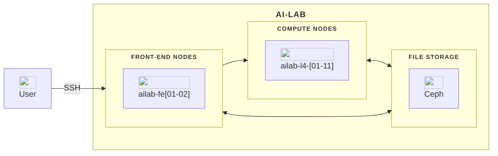

# AI-LAB under the hood

AI-LAB combines specialized hardware and software to deliver high-performance computing for AI workloads.

---

---

## 🖥️ Hardware Overview

| Component         | Description                                    |
| ----------------- | ---------------------------------------------- |
| **Login Nodes**   | 2 nodes for connecting and submitting jobs     |
| **Compute Nodes** | 11 powerful machines with GPUs                 |
| **GPUs**          | NVIDIA L4 GPUs (8 per node, 24 GB memory each) |
| **Storage**       | Central networked storage via Ceph             |

---

## ⚙️ Software Stack

| Layer      | Tool            | Purpose                                |
| ---------- | --------------- | -------------------------------------- |
| Scheduler  | **Slurm**       | Manages compute resources and queues   |
| Containers | **Singularity** | Isolates applications and dependencies |

---

**Next:** [The AI-LAB Workflow →](4-the-ai-lab-workflow.md)
