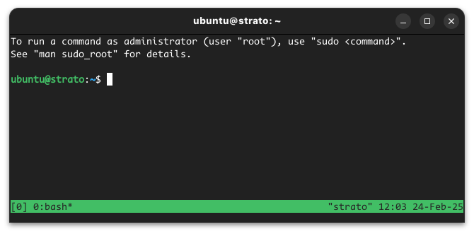
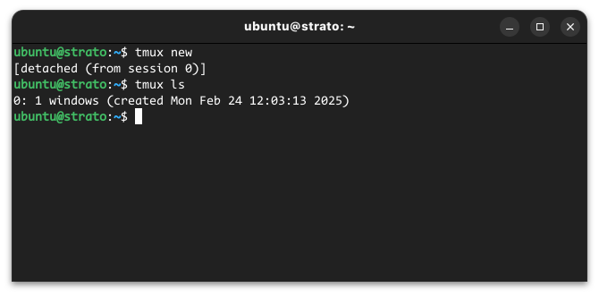

# Persistant terminal sessions
Every time you log in to a Strato instance, you are landed in a *session*. Connecting to the same instance in a different window, will land you in a new sesison. Applications launched in "Session A" will be detectable from within "Session B", but most often you will not be able to interact with them.

In many cases it can be desireable to be able to launch an application, put it away, and attach to the same session - perhaps many days later. For this purpose we can use of either `tmux` or `screen`. Both come preinstalled on most Linux distributions.

In the following we will show you the most basic features.

## Tmux

Create a new session:
```
tmux new
```



At the bottom of the window, you will see a green pane. This indicates you have entered a Tmux sesison.

Now detach from the session using: ++ctrl+b++ , ++d++ . Please note that this is: ++ctrl+b++ *and then* ++ctrl+d++ .

List open sessions (if there are any):
```
tmux ls
```


The session, we have just detached from is called `0`.

Attach to it using:
```
tmux attach -t 0
```

We could also have killed it using:
```
tmux kill-session -t 
```

These commands should be enough to get you started!

## Screen

Start a new screen:
```
screen
```

Accept the terms by pressing `Enter`. 

You should now be standing inside a new Screen session.

Detach from the current session using : ++ctrl+a++ , ++d++  (please note that this is ++ctrl+a++ *and then* ++d++ ).

You should now be in your login session again.

List the open `screen`-sessions with:

```
screen -ls
```
This outputs something like:

```
There is a screen on:
	1463.pts-0.screen-test	(09/09/21 09:48:48)	(Detached)
1 Socket in /run/screen/S-ubuntu.
```

Here 1463 is our session identifier.

Attach to the sesion with:
```
screen -r 1463
```

A session can be killed with:

```
screen -XS 1463 kill
```

These commands should be enough to get you started.
