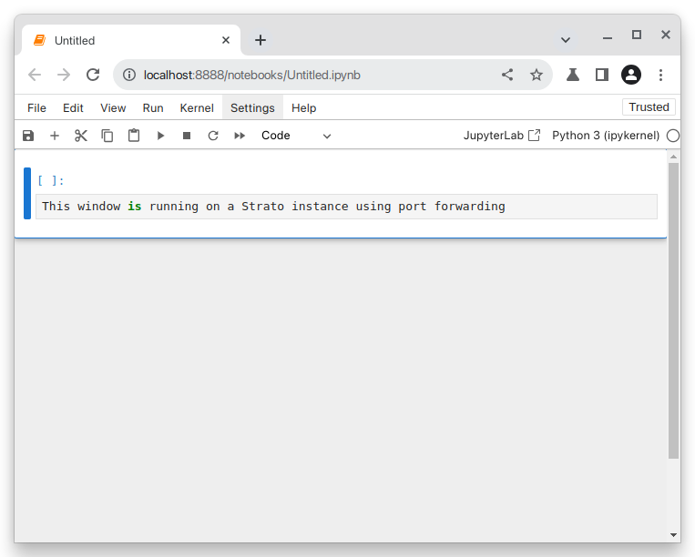

All Strato instances are essentially Linux computers with [headless interfaces](https://en.wikipedia.org/wiki/Headless_computer). They are in many ways very similar to regular desktop computers as they have a file system, network and computing capability, and they can run virtually any application - provided it can run on Linux. This is the most efficient way of distributing computing ressources and should be sufficient in most cases.

## Command Line Interfaces

For many users, operating a computer from the command line will be a new experience. At first they may not know what to do with it. and they may be tempted to install applications, that more or less turn their instance into a remote desktop. Although this may be possible, it might not necessarily be a good idea. Installing desktop capabilities will require a large number additional libraries to be installed, whereby critical system libraries are replaced, leaving you with a very non-standard instance that may be prone to errors, is difficult to troubleshoot and potentially has security risks.

!!! Tip
    A great ressource for learning how to use the Linux command line is: [linuxjourney.com](https://linuxjourney.com/lesson/the-shell)


## Graphical User Interfaces

In some cases however, you might need a graphical user interface (also known as a [GUI](https://en.wikipedia.org/wiki/Graphical_user_interface)) to do the work you need. These could be situations where your software does not have a headless interface or where it simply does not make sense to have one.

In the following we will suggest a few simple solutions for working with GUI applications on Strato.

!!! Tip
    If you find that the prospect of learning to navigate the command line will be too difficult, you may consider one of our other HPC options:

    - A more suitable alternative could be [DeiC Interactive HPC (also known as UCloud)](https://cloud.sdu.dk/app/login), which as the name indicates is built for GUI-reliant interactive HPC operations.
    - Read about our other computing services at our website: [researcher.aau.dk](https://www.researcher.aau.dk/guides/research-data/high-performance-computing). 

### Port forwarding

**This is likely the prefereable choice for most users.**

Many applications have dedicated server versions that can be run on a remote server and accessed through a web browser on your local computer.

Before you go ahead and run the application, you should consider two things:

1. Find out what port is being used to expose the application. This configuration will vary frome one application to another, but in many cases you will find that certain applications use a default port. You should be able to find this in the documentation for the application. In many cases you should also be able to specify a different port, should the default port conflict with one that's being used.

2. Establish port forwarding between the Strato instance and your local computer. We do this by adding an additional parameter to our SSH command: `-L <local_port>:localhost:<remote_port>`. Assuming that the port in question is `8888` the full command would be:
```
ssh -i ~/.ssh/<my_private_key> -L 8888:localhost:8888 ubuntu@10.92.x.xxx
```

Now you should be able to run your application in a web browser!

!!! Example
    We use Jupyter Notebook as an example.
    
    Assuming that we logged in with the `-L` parameter added to our ssh command and installed Jupyter, we can launch it with
    ```
    jupyter notebook
    ```
    
    Now find a web browser on your local computer. In Jupyter's case a URL will be outputted after executing the application. Normally it would be sufficient to go to:
    ```
    localhost:8888
    ```
    
    You should now have a fully functional Jupyter Notebook environment from within your browser!
    
    

### X11 forwarding

This approach can be good for rendering less demanding applications, plots, images, etc. In most cases rendering complete desktop software will simply be to heavy, and you will experience a considerable amount of lag.

X11 is an display server technology commonly used in Linux, and is not always supported out of the box on other operating systems. Setup will therefore depend on your operating system. In recent years there have been advances with regards to support for X11 Forwarding, and the required setup of your system has become relatively easy.

=== "Windows"
    * Ensure that you are using an appropriate terminal emulator. We recomend using Powershell. Both Powershell and OpenSSH come preinstalled with all currently supported versions of Windows.
    * Ensure that your version of OpenSSH is greater than `8.1p1`. Check the version with:
    ```
    PS C:\ ssh -V
    OpenSSH_for_Windows_8.1p1, LibreSSL 3.0.2
    ```
    If your version that is lower than 8.1p1 your version is supported. If your version is lower, you should consider updating your system.

=== "macOS"
    * Ensure that you have Xquartz installed on your system. If this is not the case it can be downloaded from the official [XQuartz webpage](https://xquartz.org).

=== "Linux desktops"
    * Check which display server you are running on your local computer. Open a terminal application and run the command:
    ```
    echo $XDG_SESSION_TYPE
    ```
        * If this outputs `X11`, you need not do anything.
        * If this outputs `wayland`, you might want to install [Waypie]("https://gitlab.freedesktop.org/mstoeckl/waypipe") or consider switching to X11 temporarily.

Now you should be ready to use the feature. We do this by verifying by adding `-X` to our initial ssh command:

```
ssh -i ~/.ssh/<my_private_key> -X ubuntu@10.92.x.xxx
```
If you did not log in to the instance with the `-X` flag, simply log out and log back in.

This will create a file in the home diretory of your Strato instance called `.Xauthority`. You can use `ls -al $HOME` to view the files in your user directory. If you find one, and the last modified date column corresponds to the time you logged in to the server, you can assume that everything went well.

!!! Example
    Now that you have logged in to your instance with `ssh -X` image windows will now get rendered on your computer.

    Assuming that I have the following R code
    ```
    x <- rnorm(100)
    y <- rnorm(100)
    plot(x, y)
    ```
    
    As soon as the `plot(x, y)` is run, this window will open:
    
    
