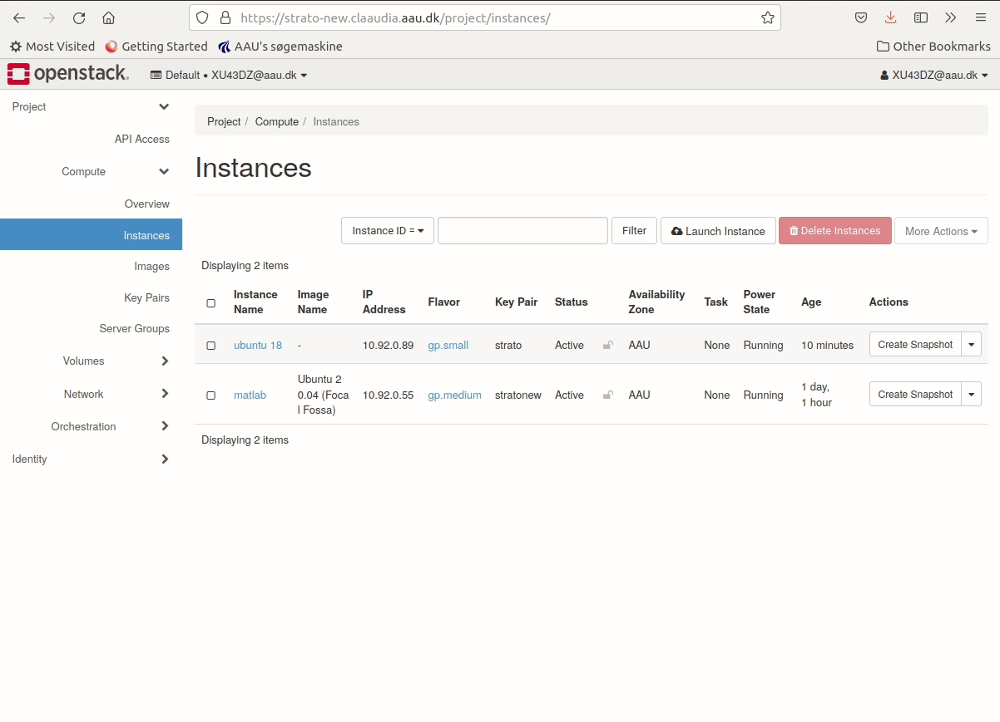

Instances in the Strato CLAAUDIA Compute cloud can have a range of **States:**

- **Active:** Instance is active, you can connect to it.
- **Shelved (CPU only):** Shelving is useful if you have a CPU only instance (i.e. no GPU) that you are not using, but would like retain in your list of servers. For example, you can stop an instance at the end of a work week, and resume work again at the start of the next week. All associated data and resources are kept; however, anything still in memory is not retained. It is, however, better practice to delete the instance and then later start a new instance from the volume with compute resources needed at that time.
- **Paused:** In this state, the server state is preserved in RAM, but operations have been stopped and will resume when instructed. This state will keep allocated resources from being used by others.
- **Suspended:** Instance state has been stored on disk, including the contents of its RAM. This state will keep allocated resources from being used by others.
- **Shutoff:** This is like powering off a server. This state will keep allocated resources from being used by others.
- **Resized:** Allows you to select a new instance flavor, after which the instance will be taken down and then come back up with the new computational resources available to it. On Linux you can check with commands such as `lscpu` and `lsmem` or `cat /proc/cpuinfo` and `cat /proc/meminfo`. This state will keep allocated resources from being used by others.

## Delete an instance

To delete an instance using the Horizon web interface you must be logged in. For an instance to be deleted, it should first be [shut down](#shut-down-an-instance). Navigate to the **launch instance** menu using the horizon web interface.

1. Navigate to the project tab
2. Click the **Compute** sub-tab
3. Click on **Instances**
4. Mark the checkbox of the instance you wish to delete.
5. Press **Delete Instances** on the right side of the webpage.
6. Press **Delete Instances** in the confirmation dialog.

Deleting an instance will not delete the attached volume, unless specifically set to during creation.

## Shelve an instance (CPU only)

It is possible to shelve an instance, but we do not recommend this practice. 

Any attempt to shelve or unshelve with a GPU flavour will end in an error state.

If you know you are not going to use a CPU only instance for a while, for example the next couple of days or even longer, it is encouraged to release the resources to make them available to other users running instances on Strato.

1. Navigate to the project tab.
2. Click the **Compute** sub-tab.
3. Click on **Instances**.
4. In the row of the instance you wish to shelve, press the dropdown menu in the right-most column, *Actions*.
5. Select **Shelve Instance** from the dropdown.

This will first shut down the instance nicely, save it to disk and subsequently release its resources. In order to use your instance again at a later point, repeat the above steps and this time select **Unshelve Instance** from the dropdown menu.  
Although other states such as **Paused**, **Suspended**, and **Shutoff** also make the instance unavailable, shelving an instance is the only approach that actually releases the resources and makes them available to other users and instances.