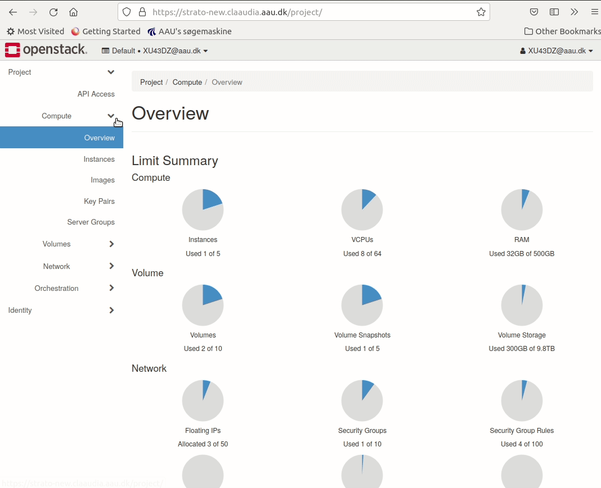
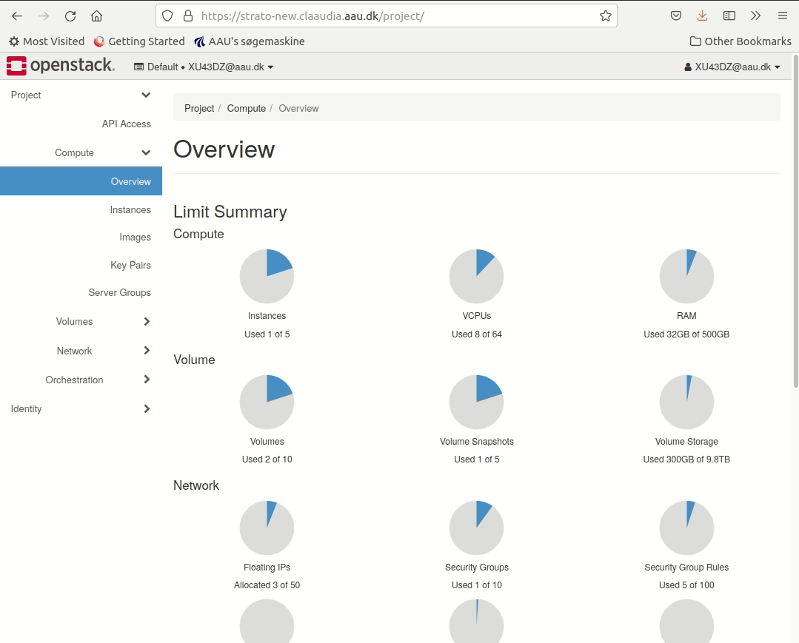
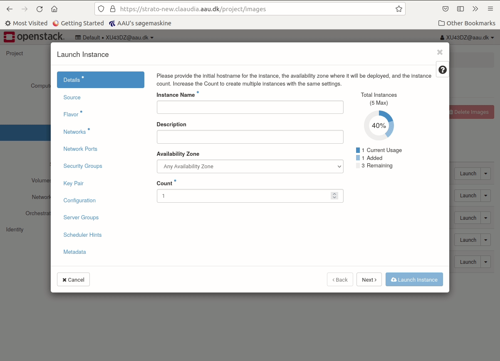

Strato instances are launched in an Openstack dashboard which can be accessed at: [**strato-new.claaudia.aau.dk**](https://strato-new.claaudia.aau.dk).

* Ensure the field **"Authenticate using"** is set to *"WAYF"* and click **Sign in**. 
* You will be redirected to *"signon.aau.dk/"* where you must login with your regular AAU credentials. Enter them and click **Sign in**.

When you have done this, you should have reached the OpenStack dashboard!

## Initial Openstack setup

The default way of accessing Strato instances is done with SSH. This a commonly used protocol in cloud computing. Before launching your first Strato instance, we need to make a couple of configurations in the OpenStack platform. 

### SSH rule

Strato configures port access with *Security groups*. Each group can have multiple rules to permit access. Follow these steps to add port 22 (standard for SSH) to the default security group.

1. Navigate to *Network -> Security Groups*
3. Click **Manage Rules** on the default Security group
4. Click **Add Rule**
5. Choose **SSH** from dropdown menu.
6. Click **Add**

### Create SSH key pair

Authenticating with SSH requires you to have an SSH key pair. This key pair consists of a public key (stored on the remote device) and a private key (stored only on your local device). 

For security reasons your SSH-key must be encrypted with a password, and therefore this needs to be done on your local computer. In the following we will create a key pair using the OpenSSH-standard compatible with Strato.

The following will work on most modern terminal emulators. For Windows users we recomend using the preinstalled application *Powershell*.

* Open your terminal application.
* Enter `cd ~/.ssh` to navigate to the conventional directory for SSH-keys.
    * If the directory doesn't exist already, you can create it with: 
        * `mkdir ~/.ssh` MacOS/Linux
        * `md ~/.ssh` on Windows
    * Don't forget to enter the directory afterwards, with `cd ~/.ssh`
    * Type `ls` to list the files in the current directory. This is just so you can keep track of what changes.
* Enter `ssh-keygen` to initiate the key generation.
* When faced with the prompt *"Enter file in which to save the key..."* you can set an optional name for your keyfile.
* Then you will asked to set a password. For security reasons, we **strongly** recommend setting a password for your keys. See AAU IT Security's [recommendations for passwords](https://www.security.aau.dk/awareness/password/).
* You should now have two files that weren't there before. Typing `ls` will reveal two new files: *"id_rsa"* and *"id_rsa.pub"* (if you chose your own file name this will have replaced the "id_rsa" part).

### Upload key pair to OpenStack

Now that we have created our key pair, we need to upload the public key to Strato 

* Navigate to *Compute -> Key Pairs*
* Click **Import Public Key**. This will open a dialog box.
* Under **Key Pair Name** type in the name you gave the key, when you created it.
* Under **Key Type** select SSH. 
* Under **Load Public Key from a file** click **Browse** and navigate to the location of your keyfile.
	* On Mac OS and Linux the directory `~/.ssh` is hidden and might not be visible in your file manager.
		* MacOS *Finder* press "cmd + shift + ." to show hidden files.
		* Ubuntu/Gnome (using Nautilus file manager) press "ctrl + h" to show hidden files.
* Select your public key file (ends in *.pub*) and click **Ok**.

## Launch Ubuntu instance

To launch the Ubuntu instance navigate to the "launch instance" menu using the webinterface.

1. Navigate to *Compute -> Images*
3. Press **Launch** on the right side of the image you wish to Launch.

In the *"Launch instance"* menu you can choose the settings for the instance. In this excercise we will apply the following:

* **Details:** Choose a name for your instance.
* **Source:** Choose Ubuntu 22.04.
* **Flavour:** Choose "AAU.CPU-1-4" to create the smallest possible instance. 
* **Networks:** Select "Campus Network 01" or "Campus Network 02". If you are interested in having an instance that is globally accessible for e.g. hosting a webservice, copying data from another university etc., then select "AAU Public". Make sure you understand the security risks.
    * *Only associate one of the two networks to your instance. If you associate both; it will not work without considerable additional effort not documented here.*
* **Security groups:** Ensure that the default security group we edited earlier is applied (should be default). 
* **Key-pair:** Ensure that the key-pair created earlier is applied (should be default).

Congratulations!
 
You have launched your first instance. Now consult the ["Access instance"](access_instance.md)-section to learn how to access your instance!

Reminder: Strato is a pool of ressources shared between all users. If you do not plan on using the instance, you have just created, please delete it, so other users can make use of the ressources. Consult the page ["Shelve instance"](shutting_down.md) for instructions on how to do this.
