Effective from 16th September 2025
> **Note:** Usage management as described on this page is only applicable to the **AAU Availability Zone**. 

```mermaid
graph TD
    A("Server shut down") --> B("⏱️ 48 hours<br/>elapsed")
    B --> C("📉 Auto-resize<br/>to smallest CPU")
    C --> D("⏱️ 30 days<br/>elapsed")
    D --> E("🗑️ Auto-delete server<br/>(volumes kept)")
    E --> F("⏱️ 30 days<br/>elapsed")
    F --> G("🗑️ Delete unused<br/>volumes")

    %% Define classes for colors
    classDef event fill:#e6f3ff,stroke:#1d70b8,color:#0b0c0c,font-size:14px;
    classDef action fill:#fff2f2,stroke:#d4351c,color:#0b0c0c,font-size:14px;

    %% Assign classes
    class A,B,D,F event;
    class C,E,G action;
```

  <!-- Mermaid Diagram -->
  

    

  

  <!-- Explanatory Text Column -->
  

  <h4>How this affects you</h4>

  <ul>
    <li><strong>Server shut down</strong>: Usage management is triggered when a server is shut down. This can happen either manually or automatically during the service window.</li>
    <li><strong>After 48 hours</strong>: If a VM remains shut down for 48 hours, it is <strong>automatically resized</strong> to the smallest CPU size. This frees up resources for active research. You can easily resize your server again when needed.</li>
    <li><strong>After 30 days</strong>: If a VM stays shut down for an additional 30 days, it is <strong>automatically deleted</strong>. However, its attached volumes are retained to keep your data safe.</li>
    <li><strong>Unused volumes</strong>: Volumes that are not attached to any VM for 30 days are <strong>deleted</strong>.</li>
  </ul>

  <h4>Tips</h4>

  <ul>
    <li><strong>Want to keep your server running after service windows?</strong> If your server is part of a dedicated research project, register the VM for auto-restart before the service window begins.</li>
    <li><strong>Want to keep your server active?</strong> Simply start it up whenever you need it.</li>
    <li><strong>Back up your data regularly</strong>: Strato is not a storage platform and does not maintain backups. We recommend backing up your data elsewhere.</li>
    <li><strong>Resize manually when needed</strong>: You can resize your server up or down based on your current needs. This helps free up resources and ensures they are available when you need them.</li>
  </ul>

  

