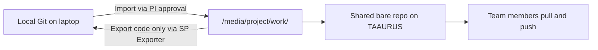

# Git for TAAURUS projects

This guide explains how to set up Git **for each TAAURUS project**, how to keep repositories on shared project storage, and how project members can collaborate without overwriting each other's work.

Git is useful for tracking changes to scripts, notebooks, job definitions, and configuration files. It is **not** a substitute for storing datasets—those belong in `data/`, outside version control.

!!! info "What works on TAAURUS"
    - Local Git repositories on shared project storage
    - A shared bare repository that all members push to
    - Branches, commits, and merges between team members

TAAURUS is **isolated from the public internet**. You cannot run `git clone https://github.com/...` on the platform. Team collaboration happens through a **shared repository on project storage**, or by moving approved code in and out through the import/export process.


---

## One repository per project

Each TAAURUS project has its own storage under `/media/`. This guide shows you how to set up **one shared Git repository per project**.

Typical layout:

```
/media/<project-name>/
├── data/              # Datasets — never commit to Git
├── work/              # Code and scripts — use Git here
│   ├── repo.git/      # Shared bare repository (central hub)
│   └── analysis/      # Working copy (each member clones here)
└── export/            # Files prepared for export
```

!!! info "Why not `/home`?"
    Your home directory (`/home/domain.aau.dk/<user>`) is personal, not backed up for project work, and not visible to other project members. Use the [shared project directories](/taaurus/guides/before-running-jobs/#know-your-directories) for team code.

---

## One-time setup per user

Each person configures their Git identity **once** on TAAURUS (not per project). This name and email appear in commit history across all projects you work on.

```bash
git config --global user.name "Your Name"
git config --global user.email "your.name@domain.aau.dk"
```

Verify:

```bash
git config --global --list
```

Optional defaults:

```bash
git config --global init.defaultBranch main
git config --global pull.rebase false
```

---

## Set up Git for a project (first time)

The recommended pattern is a **bare repository** on shared storage (the central hub) plus a **working copy** where you edit files day to day.

One person—typically the PI or a designated developer—performs the initial setup. Everyone else clones from the bare repo.

!!! info "Replace `<project-name>` with your real project folder"
    In all commands below, `<project-name>` is a **placeholder**. Do not type the angle brackets.

    Find your project name:

    ```bash
    ls /media
    ```

### Step 1: Configure Git

Run [one-time setup](#one-time-setup-per-user) first, especially:

```bash
git config --global init.defaultBranch main
```

This avoids the bare repo defaulting to `master`.

### Step 2: Create the bare repository

```bash
cd /media/<project-name>/work
mkdir -p repo.git
cd repo.git
git init --bare
cd ..
```

The bare repo stores history only. **Do not edit files directly inside `repo.git`.**

### Step 3: Clone into a working copy

```bash
git clone /media/<project-name>/work/repo.git analysis
cd analysis
```

`warning: You appear to have cloned an empty repository` is **normal** at this point.

### Step 4: Add files before the first commit

An empty folder cannot be committed. Create at least a `.gitignore` (and optionally `README.md`) **before** `git add`:

```bash
nano .gitignore
```

Example `.gitignore`:

```gitignore title=".gitignore"
# Large or sensitive data files
*.csv
*.tsv
*.parquet
*.h5
*.hdf5
*.nii
*.dcm
*.zip
*.tar.gz

# Generated outputs and caches
checkpoints/
outputs/
results/
logs/
__pycache__/
*.pyc
.ipynb_checkpoints/

# Secrets and local config
.env
*.key
```

Optional:

```bash
echo "# Project analysis code" > README.md
```

### Step 5: Initial commit and push

```bash
git add .
git status          # Must show files under "Changes to be committed"
git commit -m "Initial project structure"
git branch          # Should show * main (or master)
git push -u origin main
```

Share the project path with your team so they can clone the same repository.

---

## Onboarding a new project member

When someone new joins the project:

1. The new member logs into TAAURUS and completes [one-time Git setup](#one-time-setup-per-user) if not done already.
2. They clone the shared repository (or pull if they already have a copy):

    ```bash
    cd /media/<project-name>/work
    git clone /media/<project-name>/work/repo.git analysis
    cd analysis
    git pull origin main
    ```

3. Agree as a team on folder structure, branch rules, and who reviews merges into `main`.

Read-only members can clone and pull but cannot push. They should coordinate code changes through a colleague with write access.

---

## Team workflow between project members

### Daily routine

Use the same simple workflow across the team:

1. **Pull** before you start work
2. **Edit** scripts or notebooks in your working copy
3. **Commit** small, logical changes with clear messages
4. **Push** when a unit of work is ready for others

```bash
cd /media/<project-name>/work/analysis
git pull origin main
# ... do your work ...
git add path/to/changed_files
git commit -m "Add preprocessing script for cohort A"
git push origin main
```

### Resolving merge conflicts

If two people change the same lines, Git asks you to resolve the conflict:

```bash
git pull origin main
# Git reports a conflict in a file
nano conflicted_file.py   # Edit markers <<<<<<< ======= >>>>>>>
git add conflicted_file.py
git commit -m "Resolve merge conflict in preprocessing"
git push origin main
```

If you are unsure, ask a colleague or contact [CLAAUDIA support](https://serviceportal.aau.dk/serviceportal?id=sc_cat_item&sys_id=a05e2fb4c3434610f0f3041ad001310e).

---

## Working with Git outside TAAURUS

Many teams keep a **non-sensitive** copy of their code on a laptop or in a university Git service, and move approved code onto TAAURUS when needed.

### Recommended pattern



1. Develop and test non-sensitive code locally with Git (GitHub, GitLab, or local only).
2. **Import** approved code into `/media/<project-name>/work/` following the [import workflow](/taaurus/guides/import-export-of-data/#importing-data) (PI submits the service request).
3. Copy or merge imported files into the on-platform working copy and commit to the shared bare repo.
4. When exporting scripts **out** of TAAURUS, use [SP Exporter](/taaurus/guides/import-export-of-data/#exporting-data) and ensure exports are approved by the PI.

## Syncing an existing external repository

If you already have a repository on your laptop:

1. Work locally until the code is ready for TAAURUS.
2. Create a ZIP of the repository **without** data files (or use `git archive`).
3. Request import to `/media/<project-name>/work/` through the PI.
4. On TAAURUS, copy files into the existing working copy and commit—or set up the bare repo as described above if this is a new project.

You **cannot** add `https://github.com/...` as a remote on TAAURUS and push/pull directly, because outbound internet access is blocked.

---

## Example project layout

A typical setup after onboarding:

```
/media/my-study/
├── data/
│   └── cohort_2024/           # Not in Git
├── work/
│   ├── repo.git/              # Bare repo (central)
│   └── analysis/              # Working copy (clone of repo.git)
│       ├── .gitignore
│       ├── README.md
│       ├── scripts/
│       ├── notebooks/
│       └── slurm/
└── export/
```

---

## Quick reference

| Task | Command |
| --- | --- |
| List projects | `ls /media` |
| Clone shared repo | `git clone /media/<project>/work/repo.git analysis` |
| See status | `git status` |
| Stage changes | `git add <file>` or `git add .` |
| Commit | `git commit -m "Describe the change"` |
| Push to shared repo | `git push origin main` |
| Pull latest changes | `git pull origin main` |
| View history | `git log --oneline` |
| Create branch | `git checkout -b feature/name` |
| See remotes | `git remote -v` |

---
