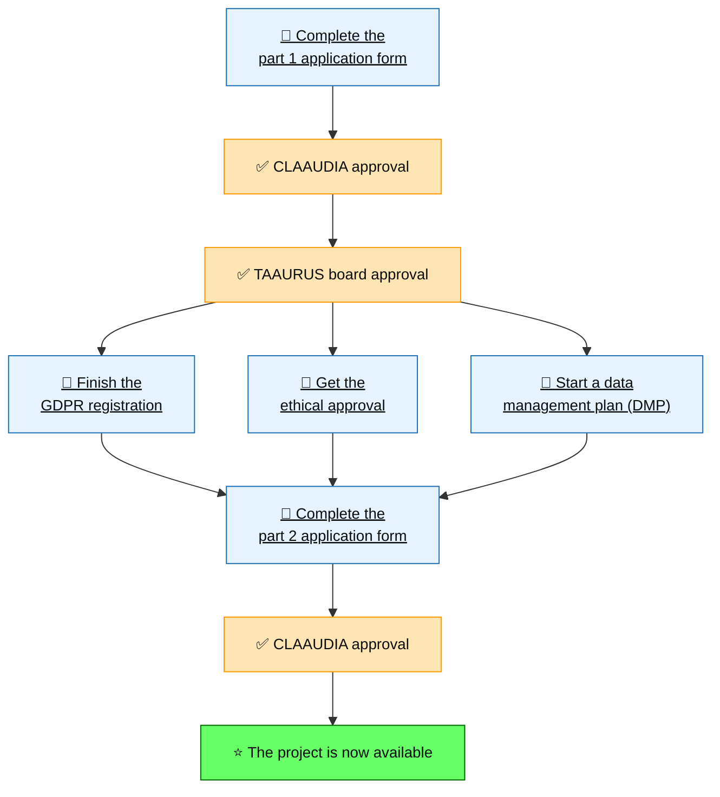

# How to access

## Who can get access?

At this time, access to TAAURUS is available to researchers affiliated with the Faculty of Medicine (SUND) at Aalborg University.

If you are unsure whether you are eligible, please contact CLAAUDIA via the [AAU Service Portal](https://serviceportal.aau.dk/serviceportal?id=sc_cat_item&sys_id=34e8536083cfc21053711d447daad30a).

---

## Overview of the application process

!!! info "Application process details" 

    Working on TAAURUS requires a two-part application. You must complete Part 1 before submitting Part 2.

    **Part 1 - Plan your research project**

    Use [this form](https://serviceportal.aau.dk/serviceportal?id=sc_cat_item&sys_id=04934a6cc3a5e210f0f3041ad00131fc) to describe your project and compute needs.

    Along with this or after getting approved, you should:

    - [Initiate GDPR registration for the project](https://aaudk.sharepoint.com/sites/persondata-ressourcer/SitePages/Anmeldelse%20og%20registreringer.aspx)
    - [Initiate the relevant ethical approvals](https://forms-intern.aau.dk/dialogue/AAU084/Ansgning_om_forskningsetisk_godkendelse)
    - [Start a data management plan (DMP)](https://www.researcher.aau.dk/guides/research-data-and-software/data-management/data-management-planning)

    For writing a Data Management Plan (DMP), we recommend using [DeiC DMP](https://dmp.deic.dk/plans/new), but other DMP tools are also acceptable. At CLAAUDIA, we support the use of DeiC DMP and can guide you in using the system. We also offer [consulting and guidance](https://serviceportal.aau.dk/serviceportal?id=sc_cat_item&sys_id=66738c41c3c34610f0f3041ad001310d) on how to write a DMP.

    **Timing of approvals:** These items do not need to be fully approved to submit Part 1, but they must be approved before you submit Part 2.

    After Part 1 is submitted, you can proceed to Part 2 once the items above have been approved.

    **Part 2 - Create your TAAURUS project**

    Use [this form](https://serviceportal.aau.dk/serviceportal?id=sc_cat_item&sys_id=3f559ee0c329e210f0f3041ad00131c8) to request creation of the actual project on TAAURUS. This step can only be completed when Part 1 is submitted and your GDPR/ethics/DMP work has been initiated. The form must be submitted by the project's Principal Investigator (PI).

<!-- 

---

## Modifying an existing TAAURUS project

Use [this modification form](https://serviceportal.aau.dk//serviceportal?id=sc_cat_item&sys_id=6e3aa12a838ee61053711d447daad3c1) if you need to change any of the following:

* Add new members
* Change Administrator
* Add new Applications
* Add more capacity
* Import of extra data
* Project extension
* Project shutdown before time 

-->

!!! info "Questions"

    If you have questions during the process, contact CLAAUDIA via the [AAU Service Portal](https://serviceportal.aau.dk/serviceportal?id=sc_cat_item&sys_id=a05e2fb4c3434610f0f3041ad001310e).

---

## After approval: next steps

Once your project is active, you are ready to start using TAAURUS. To get started, we recommend that you begin by reading the [TAAURUS guides](/taaurus/guides/login/).

