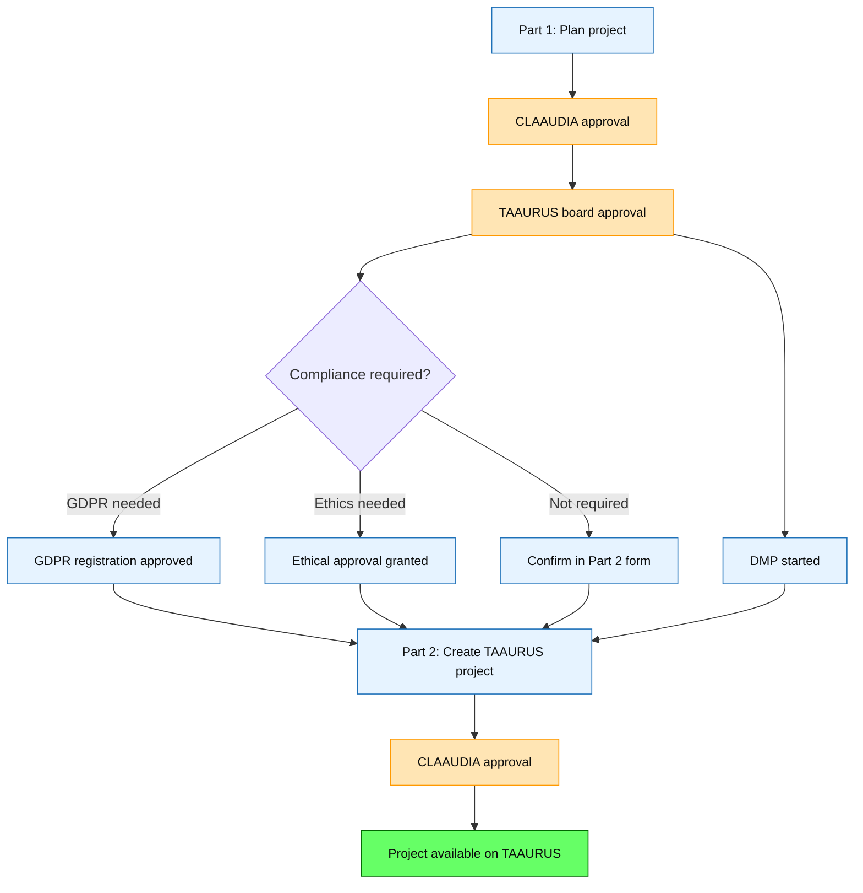

# How to access

## Who can get access?

Access to TAAURUS is available to **researchers** at Aalborg University (for example PhD students, postdocs, and faculty).

**Students** do not have direct access to TAAURUS. For student-focused HPC, see [AI-LAB](/ai-lab/).

If you are unsure whether you are eligible, contact CLAAUDIA via the [AAU Service Portal](https://serviceportal.aau.dk/serviceportal?id=sc_cat_item&sys_id=34e8536083cfc21053711d447daad30a).

---

## Application overview

Getting a TAAURUS project is a **two-step process**. You must complete Part 1 before submitting Part 2.

| Step | Who submits | Purpose |
| --- | --- | --- |
| **Part 1** | Researcher | Describe the project and compute needs |
| **Part 2** | Principal Investigator (PI) | Request creation of the project on TAAURUS |

!!! info "Quick links"
    - [Part 1 — Plan your research project](https://serviceportal.aau.dk/serviceportal?id=sc_cat_item&sys_id=04934a6cc3a5e210f0f3041ad00131fc)
    - [Part 2 — Create your TAAURUS project](https://serviceportal.aau.dk/serviceportal?id=sc_cat_item&sys_id=3f559ee0c329e210f0f3041ad00131c8)
    - [Modify a running TAAURUS project](https://serviceportal.aau.dk/serviceportal?id=sc_cat_item&sys_id=6e3aa12a838ee61053711d447daad3c1)

---

## Part 1 — Plan your research project

Use the [Part 1 form](https://serviceportal.aau.dk/serviceportal?id=sc_cat_item&sys_id=04934a6cc3a5e210f0f3041ad00131fc) to describe your project and compute needs.

Along with Part 1—or after CLAAUDIA approval—you should start the compliance work your project requires:

- [Initiate GDPR registration](https://aaudk.sharepoint.com/sites/persondata-ressourcer/SitePages/Anmeldelse%20og%20registreringer.aspx) *(if applicable)*
- [Initiate ethical approval](https://forms-intern.aau.dk/dialogue/AAU084/Ansgning_om_forskningsetisk_godkendelse) *(if applicable)*
- [Start a data management plan (DMP)](https://www.researcher.aau.dk/guides/research-data-and-software/data-management/data-management-planning)

For writing a DMP, we recommend [DeiC DMP](https://dmp.deic.dk/plans/new), but other DMP tools are also acceptable. CLAAUDIA can [guide you in writing a DMP](https://serviceportal.aau.dk/serviceportal?id=sc_cat_item&sys_id=66738c41c3c34610f0f3041ad001310d).

!!! note "Timing of approvals"
    GDPR registration and ethical approval do **not** need to be fully approved before you submit Part 1, but they **must** be approved before you submit Part 2—unless your project does not require them (see Part 2 below).

    A DMP does **not** need to be finished before Part 2, but you **must** have started working on it.

---

## Part 2 — Create your TAAURUS project

Use the [Part 2 form](https://serviceportal.aau.dk/serviceportal?id=sc_cat_item&sys_id=3f559ee0c329e210f0f3041ad00131c8) to request creation of the actual project on TAAURUS.

**Requirements before submitting Part 2:**

- Part 1 has been submitted
- CLAAUDIA and the TAAURUS board have approved Part 1
- You have started working on a DMP
- GDPR registration and ethical approval are **approved**—or confirmed as **not required** for your project (see below)
- The form is submitted by the project's **Principal Investigator (PI)**

### When GDPR, ethical approval, or a license is not required

The Part 2 form lets you confirm when certain compliance items **do not apply** to your project—for example:

- **No GDPR registration required** — the project does not process personal data in a way that requires registration
- **No ethical approval required** — the project does not need research ethics review

Select the relevant options only when they truly apply to your project. CLAAUDIA may follow up if the justification is unclear.

If your project **does** require GDPR registration or ethical approval, those must be fully approved before Part 2 is submitted.

---

## Application flow

```mermaid
graph TD
    A["Part 1: Plan project"] --> B["CLAAUDIA approval"]
    B --> C["TAAURUS board approval"]
    C --> D{"Compliance required?"}
    D -->|GDPR needed| E["GDPR registration approved"]
    D -->|Ethics needed| F["Ethical approval granted"]
    D -->|Not required| G["Confirm in Part 2 form"]
    C --> H["DMP started"]
    E --> I["Part 2: Create TAAURUS project"]
    F --> I
    G --> I
    H --> I
    I --> J["CLAAUDIA approval"]
    J --> K["Project available on TAAURUS"]

    click A "https://serviceportal.aau.dk/serviceportal?id=sc_cat_item&sys_id=04934a6cc3a5e210f0f3041ad00131fc" "Part 1 form" _blank
    click I "https://serviceportal.aau.dk/serviceportal?id=sc_cat_item&sys_id=3f559ee0c329e210f0f3041ad00131c8" "Part 2 form" _blank

    classDef user fill:#e6f3ff,stroke:#1d70b8,color:#0b0c0c,font-size:14px;
    classDef claaudia fill:#ffe5b4,stroke:#ff9900,color:#0b0c0c,font-size:14px;
    classDef done fill:#66ff66,stroke:#006600,color:#0b0c0c,font-size:14px;

    class A,E,F,G,H,I user;
    class B,C,J claaudia;
    class K done;
```

---

## Modify a running TAAURUS project

Use the [modification form](https://serviceportal.aau.dk/serviceportal?id=sc_cat_item&sys_id=6e3aa12a838ee61053711d447daad3c1) to request changes to an active project. What you can request depends on your **project role**.

| Request | PI | Project Administrator |
| --- | --- | --- |
| Add or remove project group members | :material-check: | — |
| Modify read/write group membership | :material-check: | — |
| Modify read-only group membership | :material-check: | — |
| Add new applications | :material-check: | :material-check: |
| Import of extra data | :material-check: | — |

!!! info "Project roles"
    When adding members in Part 1 or via the modification form, you can assign:

    - **Project Member (Read/Write)**
    - **Project Member (Read-Only)**

---

## Questions and support

If you have questions during the process, contact CLAAUDIA via the [AAU Service Portal](https://serviceportal.aau.dk/serviceportal?id=sc_cat_item&sys_id=a05e2fb4c3434610f0f3041ad001310e).

---

## After approval: next steps

Once your project is active, start with the [TAAURUS guides](/taaurus/guides/login/)—beginning with how to log in and navigate the platform.
