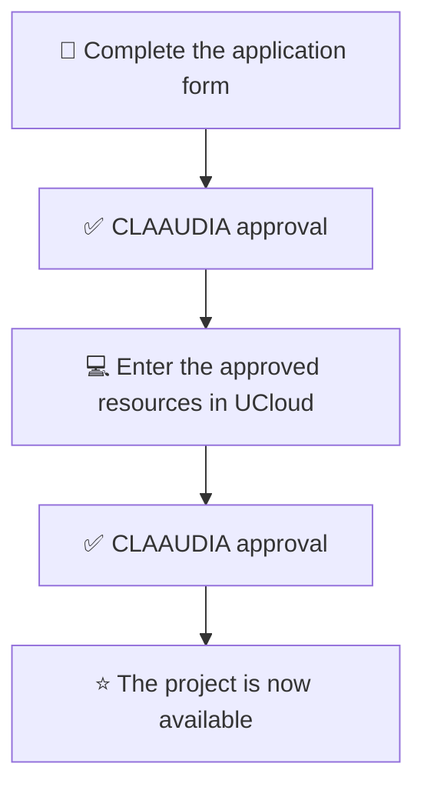

## Direct access
All Aalborg University users automatically have access to UCloud and can simply log in using their WAYF credentials (university logon credentials). This gives you access to **"My Workspace"** with a starting quota of 2000 CPU-hours that can be used in the standard web app environment. This is the quickest and most user-friendly way to access HPC as a first-time user.

<a href="https://cloud.sdu.dk/app/dashboard" target="_blank" style="display: inline-block; background: #3F59E4; color: #fff; padding: 0.7em 1.5em; border-radius: 8px; font-weight: 600; text-decoration: none; font-size: 1em; margin: 0.5em 0;">
  Log in to UCloud
</a>

## Projects
If you require a larger CPU quota, access to GPU resources, a virtual machine, or need to work with sensitive data, you can apply for a project using CLAAUDIA’s local resources.
The diagram below outlines the process for getting your project approved and set up on UCloud:

<a href="https://forms.office.com/e/8Khbr1TJGC" target="_blank" style="display: inline-block; background: #3F59E4; color: #fff; padding: 0.7em 1.5em; border-radius: 8px; font-weight: 600; text-decoration: none; font-size: 1em; margin: 0.5em 0;">
  Apply for UCloud project
</a>

  <!-- Mermaid Diagram -->
  

  

  <!-- Info Box -->
  

    

      
Sensitive data:

      <ul>
        <li> You must have a WorkZone case number for your research project.
           If you don't have one, you can apply through Grants and Contracts using their <a href="#">registration form</a>.
        </li>
        <li> Only SDU compute resources may be used to handle sensitive data.</li>
        <li> To get started, read <a href="/ucloud/guides/sensitive-data-on-ucloud/">our guide</a> on how to handle sensitive data on UCloud.</li>
      </ul>
    

  

<a href="https://aau.service-now.com/serviceportal?id=sc_cat_item&sys_id=34e8536083cfc21053711d447daad30a" target="_blank" 
   style="display: block; background-color:rgb(241, 109, 109); color: white; padding: 1em; text-align: center; border-radius: 8px; font-weight: bold; text-decoration: none; font-size: 1.1em; margin: 1em 0;">
   Need assistance? Reach us at the Service Portal
</a>
