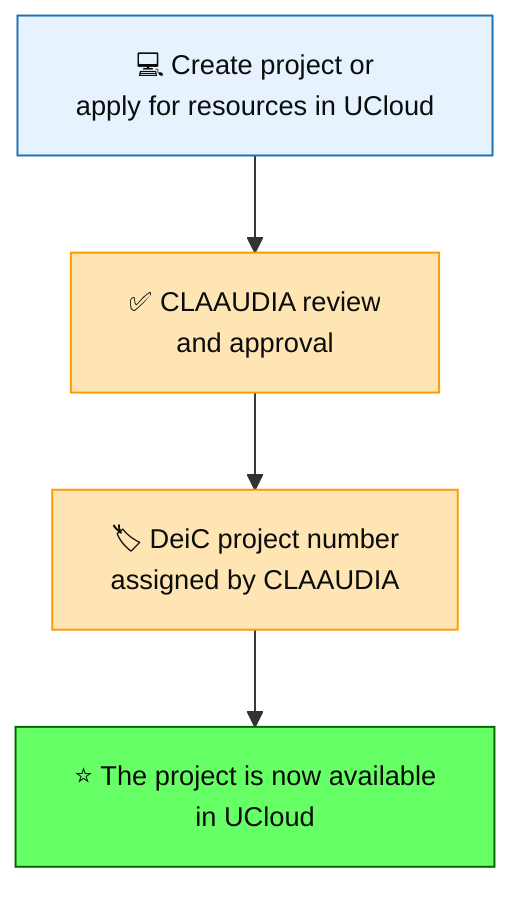

## Direct access
All Aalborg University users automatically have access to UCloud and can simply log in using their WAYF credentials (university logon credentials). This gives you access to **"My Workspace"** with a starting quota of 2000 CPU-hours that can be used in the standard web app environment. This is the quickest and most user-friendly way to access high-performance computing (HPC) as a first-time user.

[Log in to UCloud](https://cloud.sdu.dk/app/dashboard){ .md-button .md-button--primary target=_blank }

## Projects
If you require a larger CPU quota, access to GPU resources, a virtual machine, or need to work with sensitive data, you can apply for a project using CLAAUDIA’s local resources.

**Important:** If your project involves personally identifiable information, you must register your data with the Grant and Contract Unit. You can find detailed instructions for this process in our [guide on handling sensitive data on UCloud](/ucloud/guides/sensitive-data-on-ucloud/).

The diagram below outlines the process for getting your project approved and set up on UCloud:

[Expanded application guide](/ucloud/expanded-application-guide/){ .md-button .md-button--primary target=_blank }

  <!-- Mermaid Diagram -->
  

```mermaid
graph TD
    A["💻 Create project or <br/>apply for resources in UCloud"]
    --> B["✅ CLAAUDIA review <br/>and approval"]
    B --> C["🏷️ DeiC project number <br/>assigned by CLAAUDIA"]
    C --> D["⭐ The project is now available <br/>in UCloud"]

    %% Clickable entry point
    click A "https://cloud.sdu.dk/app/dashboard" "Open UCloud dashboard" _blank

    %% Define classes for colors
    classDef User fill:#e6f3ff,stroke:#1d70b8,color:#0b0c0c,font-size:14px;
    classDef CLAAUDIA fill:#ffe5b4,stroke:#ff9900,color:#0b0c0c,font-size:14px;
    classDef Completed fill:#66ff66,stroke:#006600,color:#0b0c0c,font-size:14px;

    %% Assign classes
    class A User;
    class B,C CLAAUDIA;
    class D Completed;
```
  

  <!-- Info Box -->
  

    

      
Sensitive data:

      <ul>
        <li> You must have a WorkZone case number for your research project.
           If you don't have one, you can apply through Grants and Contracts using their <a href="https://aaudk.sharepoint.com/sites/persondata-ressourcer/SitePages/Registrations%20og%20reports%20(Online%20forms).aspx">registration form</a>.
        </li>
        <li> To get started, read <a href="/ucloud/guides/sensitive-data-on-ucloud/">our guide</a> on how to handle sensitive data on UCloud.</li>
        <li> If your research project is governed by a separate data processing or a subordinate data processing agreement, you will need to identify the WorkZone case number that includes the relevant contract information. This case should include that the project is processing data on the UCloud platform.</li>
      </ul>
    

  

## National HPC Resources

Twice a year it's possible to apply for a share in DeiC's National HPC resources. This possibility is especially well suited for projects with large resource requirements.
To learn more about this oppurtunity, please find our page dedicated to this possibility: [DeiC HPC resources](/external-hpc/deic-resources/).

[Need assistance? Reach us at the Serviceportal](https://aau.service-now.com/serviceportal?id=sc_cat_item&sys_id=34e8536083cfc21053711d447daad30a){ .md-button .md-button--primary target=_blank }
